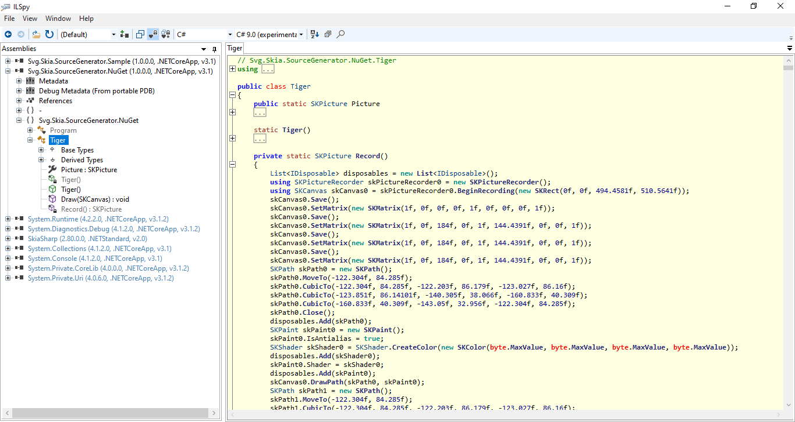

# Svg to C# Source Generators


[](https://www.nuget.org/packages/svg.skia.sourcegenerator)
[](https://www.nuget.org/packages/svg.skia.sourcegenerator)

[](https://github.com/wieslawsoltes/sourcegenerators)
[](https://github.com/wieslawsoltes/sourcegenerators)
[](https://github.com/wieslawsoltes/sourcegenerators)

SVG to C# Compiler

### About

SVGC compiles SVG drawing markup to C# using SkiaSharp as rendering engine. SVGC can be also used as codegen for upcomming C# 9 Source Generator feature.

[](images/Demo.png)

### NuGet

* https://www.nuget.org/packages/Svg.Skia.SourceGenerator
* https://www.nuget.org/packages/svgc
* https://www.nuget.org/packages/Svg.Skia.CodeGen

### Source Generator Usage

Add NuGet package reference to your `csproj`.

```xml
<PropertyGroup>
  <OutputType>Exe</OutputType>
  <TargetFramework>netcoreapp3.1</TargetFramework>
  <LangVersion>preview</LangVersion>
</PropertyGroup>
```

```xml
<ItemGroup>
  <PackageReference Include="Svg.Skia.SourceGenerator" Version="0.1.0-preview6" />
</ItemGroup>
```

Include `svg` assests file in your `csproj`.

```xml
<ItemGroup>
  <AdditionalFiles Include="Assets/Sample.svg" NamespaceName="Assets" ClassName="Sample" />
</ItemGroup>
```

Use generated `SKPicture` using static `Picture` property from `Sample` class.

```C#
using SkiaSharp;
using Assets;

public void Draw(SKCanvas canvas)
{
    canvas.DrawPicture(Sample.Picture);
}
```

### svgc Usage

```
svgc:
  Converts a svg file to a C# code.

Usage:
  svgc [options]

Options:
  -i, --inputFile <inputfile>      The relative or absolute path to the input file [default: ]
  -o, --outputFile <outputfile>    The relative or absolute path to the output file [default: ]
  -j, --jsonFile <jsonfile>        The relative or absolute path to the json file [default: ]
  -n, --namespace <namespace>      The generated C# namespace name [default: Svg]
  -c, --class <class>              The generated C# class name [default: Generated]
  --version                        Show version information
  -?, -h, --help                   Show help and usage information
```

Json File Format
```json
[
    { "InputFile":"file1.svg", "OutputFile":"file1.svg.cs", "Class":"ClassName1", "Namespace":"NamespaceName" },
    { "InputFile":"file2.svg", "OutputFile":"file2.svg.cs", "Class":"ClassName2", "Namespace":"NamespaceName" }
]
```

### Links

* [Source Generators Cookbook](https://github.com/dotnet/roslyn/blob/master/docs/features/source-generators.cookbook.md)
* [Source Generators](https://github.com/dotnet/roslyn/blob/master/docs/features/source-generators.md)
* [Source Generators Samples](https://github.com/dotnet/roslyn-sdk/tree/master/samples/CSharp/SourceGenerators)
* [Introducing C# Source Generators](https://devblogs.microsoft.com/dotnet/introducing-c-source-generators/)

## License

Svg to C# Source Generators is licensed under the [MIT license](LICENSE.TXT).
